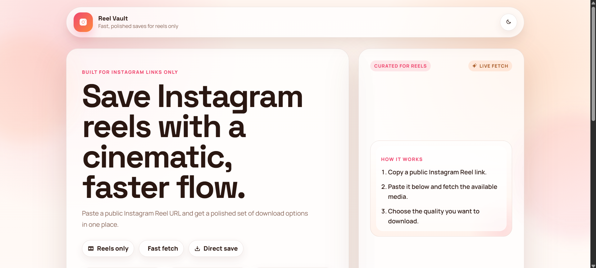
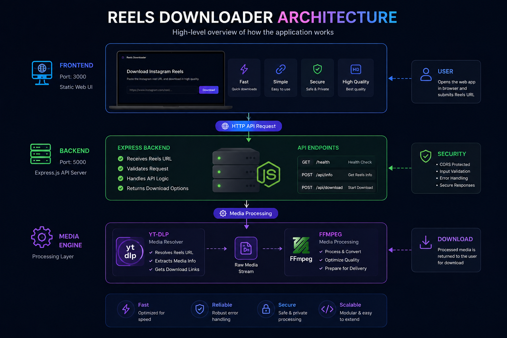
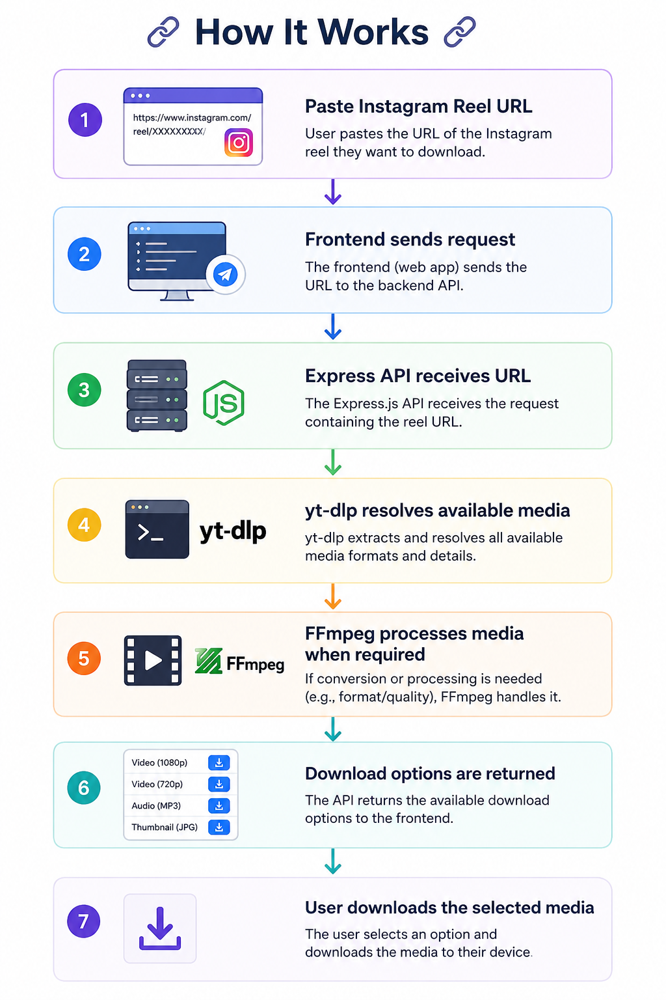

# 🎬 Instagram Reels Downloader

### Download publicly accessible Instagram Reels, videos, audio & image assets through a simple web interface.

---

## ✨ Features

- 🎥 Download publicly accessible Instagram Reels
- 🔗 Simple Instagram URL input
- 🎵 Direct audio download support
- 🖼️ Image asset support when available
- ⚡ Lightweight Express backend
- 🌐 Simple static frontend
- 🛠️ Powered by `yt-dlp`
- 🎬 Uses `FFmpeg` for media processing
- 🔒 Environment-variable based configuration
- 💻 Designed for local/self-hosted usage

---

## 🖥️ Preview



### 🎥 Demo

[▶️ Watch Demo](video/Demo.mp4)

**Paste URL → Fetch → Preview → Download**

---

## 🏗️ Architecture

The application follows a simple client-server media-processing architecture:




---

## 🛠️ Tech Stack

| Layer | Technology |
|:---|:---|
| Frontend | HTML, CSS, JavaScript |
| Backend | Node.js |
| API | Express.js |
| Media Resolver | `yt-dlp` |
| Media Processing | `FFmpeg` |
| Configuration | `dotenv` / Environment Variables |
| Development | Git + GitHub |

---

## 📁 Project Structure

```text
reels-downloader/
│
├── backend/
│   ├── server.js
│   ├── package.json
│   └── ...
│
├── frontend/
│   ├── index.html
│   ├── server.js
│   └── ...
│
├── images/
│   ├── home.png
│   ├── architecture.png
│   └── workflow.png
│
├── video/
│   └── Demo.mp4
│
├── .env.example
├── .gitignore
├── package.json
└── README.md
```

---

## ⚙️ Requirements

Before running the project, make sure you have:

- [Node.js](https://nodejs.org/) installed
- `yt-dlp` installed and available in your `PATH`
- `FFmpeg` installed and available in your `PATH`
- Git installed

Check your installations:

```bash
node --version
npm --version
yt-dlp --version
ffmpeg -version
```

---

## 🚀 Installation

### 1. Clone the repository

```bash
git clone https://github.com/SRIGANTH-K/reels-downloader.git
cd reels-downloader
```

### 2. Install backend dependencies

```bash
cd backend
npm install
cd ..
```

### 3. Configure environment variables

Copy the example environment file:

```bash
cp .env.example .env
```

On Windows PowerShell:

```powershell
Copy-Item .env.example .env
```

Configure the required values in `.env`.

---

## ▶️ Run the Application

Open **two terminals**.

### Terminal 1 — Backend

From the project root:

```bash
node backend/server.js
```

Backend:

```text
http://localhost:5000
```

### Terminal 2 — Frontend

```bash
node frontend/server.js
```

Frontend:

```text
http://localhost:3000
```

Then open:

**http://localhost:3000**

---

## 🔗 How It Works

The application processes a Reel through the following workflow:




---

## 🔐 Environment Variables

| Variable | Description |
|:---|:---|
| `PORT` | Backend server port |
| `TRUST_PROXY` | Proxy configuration |
| `FRONTEND_URL` | Frontend origin |
| `YT_DLP_PATH` | Custom yt-dlp executable path |
| `YT_DLP_COOKIES` | Optional cookie configuration |
| `YT_DLP_COOKIES_FILE` | Optional cookie file |

See `.env.example` for the available configuration.

---

## 🧪 Health Check

After starting the backend, verify:

```text
http://localhost:5000/health
```

Expected response:

```json
{
  "status": "ok"
}
```

---

## ⚠️ Limitations

- Only publicly accessible Instagram Reel URLs are supported.
- Download availability depends on what `yt-dlp` can resolve.
- Instagram may change its platform behavior, which can affect downloading.
- Some content may require authentication.
- `yt-dlp` and FFmpeg must be correctly installed and accessible.

---

## 🛡️ Responsible Use

This project is intended for **personal use and learning purposes**.

Only download content that you have permission to download. Respect Instagram's terms, copyright, intellectual-property rights, and the rights of content creators.

This project is not affiliated with or endorsed by Instagram or Meta.

---

## 🔮 Future Improvements

- 📱 Responsive UI improvements
- 📊 Download progress indicator
- 🎬 Media preview before downloading
- 🛡️ Better error handling
- ⚙️ Automatic quality selection
- 🕘 Download history
- 📦 Queue-based processing
- 🐳 Docker support
- 🌐 Production deployment configuration
- 🧪 Automated tests
- 🔄 CI/CD with GitHub Actions

---

## 🤝 Contributing

Contributions, suggestions, and improvements are welcome.

### 1. Fork the repository

### 2. Create a feature branch

```bash
git checkout -b feature/your-feature
```

### 3. Commit your changes

```bash
git commit -m "Add your feature"
```

### 4. Push the branch

```bash
git push origin feature/your-feature
```

### 5. Open a Pull Request

---

## 👨‍💻 Author

### Sri Ganth K

[](https://github.com/SRIGANTH-K)

[](https://www.linkedin.com/in/sri-ganth-k/)

[](https://www.instagram.com/sri_ganth_k/)

---

⭐ If you find this project useful, consider giving it a star!

**Built with Node.js + Express + yt-dlp + FFmpeg**
